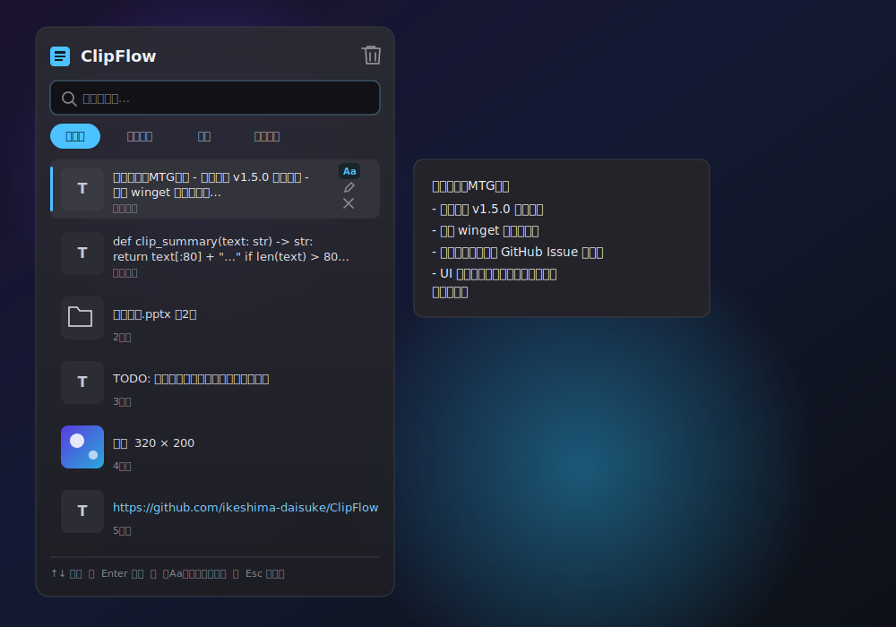

# ClipFlow

Windows 向けの軽量クリップボード履歴マネージャ。コピーしたテキスト・画像を自動で履歴に溜め、ホットキーでいつでも呼び出して貼り付けられます。



## ダウンロード

**[最新版を GitHub Releases から入手](../../releases/latest)**（`ClipFlow-x.y.z-win-x64.zip`）

1. zip を展開して `ClipFlow.exe` をどこか好きな場所に置く（インストーラー不要・.NETランタイムのインストールも不要）
2. 実行すると初回に **Windows SmartScreen の警告**が出ます（未署名の個人配布アプリのため）。
   「詳細情報」→「実行」で起動できます。心配な場合はダウンロード元がこのリポジトリであることを確認してから実行してください。
3. タスクトレイに常駐します。`Ctrl+Shift+V` で呼び出せます。

## 特長

- 📋 **テキスト / 画像 / ファイル** を自動でキャプチャして履歴化
- ⌨️ **`Ctrl+Shift+V`** で履歴ポップアップを表示
- 🔎 **検索** と **種別フィルター（すべて / テキスト / 画像 / ファイル）** で素早く絞り込み
- 🖼️ 画像は **サムネイル表示**、エクスプローラーにも貼り付け可（ファイル化）
- 📁 エクスプローラーで **ファイル/フォルダをコピー** した履歴も残せて、そのまま別の場所へ貼り付け可能
- 🖋️ 既定は**プレーンテキスト貼り付け**（貼り先の見た目が常に予測どおり）。書式（太字・リンクなど）付きでコピーされた項目には一覧に **「Aa」ボタン**が出るので、それを押すかその項目を選んで `Ctrl+Shift+Enter` で書式ごと貼り付け可能
- ⏸️ トレイメニューから **記録を一時停止**（機微な操作の前に履歴へ残したくないとき）
- 📌 **ピン留め**でよく使う項目を常に上部へ
- 🎯 **元のカーソル位置へ自動ペースト**（クリック / Enter）
- 🪶 **保持件数は100/500/1000件・無制限から選択可**（トレイメニュー、変更は即反映）・SQLite永続化・軽快動作
- 🔄 トレイメニューから **更新確認**（既定オフのオプトイン。ONにするかその場で「今すぐ確認」した時だけGitHubへ問い合わせ）
- 🎨 Fluent Design（Acrylic）のスマートなUI、タスクトレイ常駐

## 操作

| 操作 | 動作 |
|---|---|
| `Ctrl+Shift+V` | 履歴ポップアップ表示 / 非表示 |
| `↑` `↓` | 履歴セルを選択 |
| `Enter` | 選択を元の場所へ貼り付け（既定はプレーンテキスト） |
| `Ctrl+Shift+Enter` | 書式（HTML/RTF）を保持して貼り付け |
| `Ctrl+C` | 貼り付けず、クリップボードへコピーのみ |
| `Esc` | 閉じる |
| クリック | その項目をプレーンテキストで貼り付け |
| 一覧の「Aa」ボタン | 書式を保持して貼り付け（書式付きでコピーされた項目にのみ表示） |
| トレイ右クリック | 記録の一時停止 / 履歴クリア / 起動設定 / 保持件数の上限 / 更新確認 / 終了 |

## 動作環境

- Windows 10 / 11
- .NET 10 ランタイム

## ビルドと実行

```sh
# ビルド
dotnet build src/ClipFlow/ClipFlow.csproj

# 実行
dotnet run --project src/ClipFlow/ClipFlow.csproj

# テスト
dotnet test tests/ClipFlow.Tests/ClipFlow.Tests.csproj
```

> 実行中はアプリが exe をロックするため、再ビルド前に終了が必要です（csproj のビルド前ターゲットで自動終了します）。

## スタートアップ登録

タスクトレイアイコンを右クリック → **「Windows起動時に実行」** で切替できます（レジストリ `HKCU\...\Run`）。

## データ保存先・プライバシー

- 履歴データは `%APPDATA%\ClipFlow\`（`clipflow.db` と `images/`）にローカル保存されるのみです。**クリップボードの内容自体が外部へ送信されることは一切ありません**（テレメトリなし）。
- **ネットワーク通信は「更新確認」機能のみ**で、既定はOFFです。ONにするか、トレイメニューから「今すぐ更新を確認」を選んだときだけ、GitHub の公開API（`api.github.com`）に最新リリースのバージョン番号を問い合わせます。送信するのはそのHTTPSリクエストのみで、クリップボードの中身や個人情報は一切含まれません。完全に通信を避けたい場合は、この機能を使わなければこれまで通り無通信で動作します。
- 履歴は **暗号化されずに平文で保存**されます。パスワードなど機微な情報をコピーした場合は履歴から削除するか、共有PC・バックアップ経由での漏洩に注意してください。機微な操作の前はトレイメニューの「記録を一時停止」も使えます。
- 保持件数を「無制限」にすると自動削除が働かなくなるため、画像を多くコピーする使い方では `%APPDATA%\ClipFlow\images\` のディスク使用量が増え続けます。気になる場合は上限を設定するか、定期的に「履歴をクリア」してください。
- **ファイルの履歴はパス（場所）のみを記憶**し、中身はコピーしません。Windows標準のクリップボードと同様、コピー元のファイルを移動・削除・リネームすると、その履歴からは貼り付けできなくなります。
- ソースコードは公開されているので、動作が気になる方はご自身でビルド・確認できます。

## ライセンス

[MIT License](LICENSE)

## 構成

```
src/ClipFlow/
  Models/        ClipItem
  Services/      ClipboardMonitor / GlobalHotkey / HistoryStore / PasteService / ImageHelper / StartupService / AppSettings / UpdateChecker / NativeMethods
  ViewModels/    MainViewModel / ClipItemViewModel
  MainWindow.*   履歴ポップアップ(Fluent)
  App.*          常駐・トレイ・ホットキー配線
tests/ClipFlow.Tests/   xUnit テスト
```

## 技術スタック

C# / WPF / .NET 10 / [WPF-UI](https://github.com/lepoco/wpfui) / Microsoft.Data.Sqlite / CommunityToolkit.Mvvm / Hardcodet.NotifyIcon.Wpf
