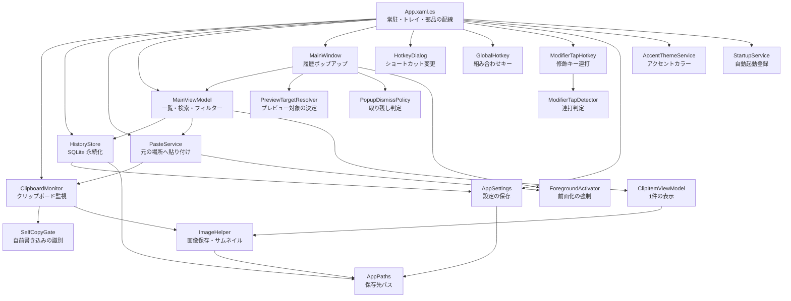

# アーキテクチャ — ClipFlow

## 概要

Windows 向けの軽量クリップボード履歴マネージャ。コピーしたテキスト・画像・ファイルを自動で履歴に溜め、ホットキーで呼び出して元の場所へ貼り付ける。タスクトレイに常駐し、外部通信は一切行わない。

実装上の注意点・落とし穴の詳細は [CLAUDE.md](../CLAUDE.md) を参照。この文書は現状の構成を記録する(2026-09-14 時点のコードを読んで作成)。

## 構成図

`Global` と `Tap` は共通インターフェース `IHotkeyTrigger` の実装。Win32 呼び出しは `NativeMethods` に集約され、多くのクラスから使われる(図では省略)。

## モジュール一覧

| モジュール | 責務 | テスト |
|---|---|---|
| `App.xaml(.cs)` | 起動処理。トレイメニュー・ホットキー・設定・各サービスの配線 | なし |
| `MainWindow.xaml(.cs)` | 履歴ポップアップ。表示位置・前面化・ホバープレビュー・キー操作 | なし |
| `HotkeyDialog.xaml(.cs)` | ショートカット変更ダイアログ(組み合わせ/連打の切り替えとキー入力キャプチャ)。ViewModel なし | なし |
| `Models/ClipItem` | 履歴1件のデータ(種別・テキスト・Html/Rtf・画像パス・ハッシュ・ピン)とファイルパスの結合/分解 | `ClipItemTests` |
| `Services/ClipboardMonitor` | `WM_CLIPBOARDUPDATE` を受けてテキスト/画像/ファイルを `ClipItem` にする | なし |
| `Services/SelfCopyGate` | 自前のクリップボード書き込みを `GetClipboardSequenceNumber` で識別して無視する | `SelfCopyGateTests` |
| `Services/HistoryStore` | SQLite への保存、重複の先頭繰り上げ、上限超過分の削除、列追加マイグレーション | `HistoryStoreTests` |
| `Services/PasteService` | 直前の前面ウィンドウへ復帰し `SendInput` で Ctrl+V | なし |
| `Services/ForegroundActivator` | `AttachThreadInput` で前面化制限を回避して前面へ出す | なし |
| `Services/IHotkeyTrigger` | ホットキートリガーの共通インターフェース | なし |
| `Services/GlobalHotkey` | `RegisterHotKey` による組み合わせホットキー。登録し直しと失敗時の復帰 | なし |
| `Services/ModifierTapHotkey` | 修飾キー連打の検出。専用スレッドの低レベルキーボードフック | `ModifierTapHotkeyTests` |
| `Services/ModifierTapDetector` | 連打判定の純粋ロジック(組み合わせ押しの除外) | `ModifierTapDetectorTests` |
| `Services/HotkeySpec` | 組み合わせ/連打のどちらも表す値 | なし |
| `Services/HotkeyFormat` | WPF と Win32 のキー表現の相互変換、表示文字列の組み立て | `HotkeyFormatTests` |
| `Services/PopupDismissPolicy` | ポップアップが取り残されていないかの判定(純粋) | `PopupDismissPolicyTests` |
| `Services/PreviewTargetResolver` | プレビュー対象の決定(ホバーと選択の優先順位、純粋) | `PreviewTargetResolverTests` |
| `Services/StartupService` | `HKCU\...\Run` での自動起動登録 | なし |
| `Services/AppSettings` | `%APPDATA%\ClipFlow\settings.json` の読み書き | なし |
| `Services/AppPaths` | 保存先パスの定義とディレクトリ作成 | なし |
| `Services/ImageHelper` | 画像の PNG 保存・サムネイル生成・ハッシュ計算・貼り付け用一時ファイル | なし |
| `Services/NativeMethods` | P/Invoke 宣言(`LibraryImport` 中心、フック関連3つのみ `DllImport`) | `NativeInputTests`(`INPUT` 構造体サイズ) |
| `Services/AccentPalette` / `AccentThemeService` | アクセントカラーの定義と WPF-UI への反映 | `AccentThemeServiceTests` |
| `ViewModels/MainViewModel` | 一覧のフィルター・検索・貼り付け/コピー/削除/ピンのコマンド | なし |
| `ViewModels/ClipItemViewModel` | `ClipItem` の表示用ラップ(画像の遅延読み込み、書式有無) | なし |
| `Themes/ClipFlowPalette.xaml` | MainWindow 専用の固定配色(Window.Resources にのみマージ) | なし |

外部パッケージ: WPF-UI(Fluent デザイン)、Hardcodet.NotifyIcon.Wpf(トレイ)、Microsoft.Data.Sqlite、CommunityToolkit.Mvvm。

## 設計判断の記録

- ClipFlow は外部通信を一切行わない方針(設定にもネットワークに触るものを入れない)
- ネイティブ/OS 連携は再現しにくいので、判定ロジックを OS 非依存の純粋クラス(`ModifierTapDetector` / `PopupDismissPolicy` / `PreviewTargetResolver` / `SelfCopyGate`)に切り出してテストで固定し、OS 依存部分は実機確認と併用する
- 2026-09-14: `/adopt` で開発ワークフローシステムを後付け適用。`.editorconfig`(`.cs` の改行を CRLF に統一)、編集時の自動整形 hook、コミット前にビルドとテストを通す hook を導入

### 既知の問題・技術的負債(現状の記録)

- `HistoryStore` と `AppSettings` が相互に依存している(`HistoryStore` の本番用コンストラクタが `AppSettings.Load()` を呼び、`AppSettings` は既定値に `HistoryStore.DefaultMaxItems` を使う)
- `AppSettings` / `AppPaths` / `ImageHelper` の保存先は `AppPaths` の静的プロパティ(`%APPDATA%\ClipFlow`)に固定で、テスト用の一時ディレクトリを注入できない。`HistoryStore` のようなパス注入口が無いため、読み書きのテストを書くと実際の設定・画像フォルダに触れてしまう
- `App.xaml.cs`・`MainWindow`・`ViewModels` にはテストが無い
